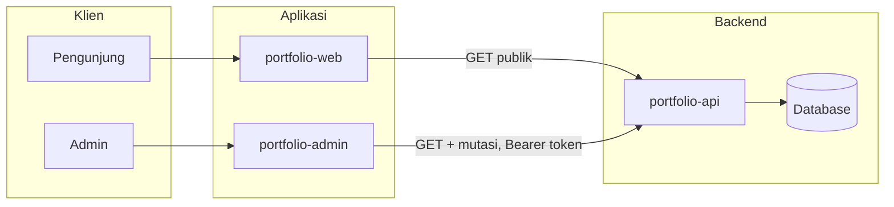
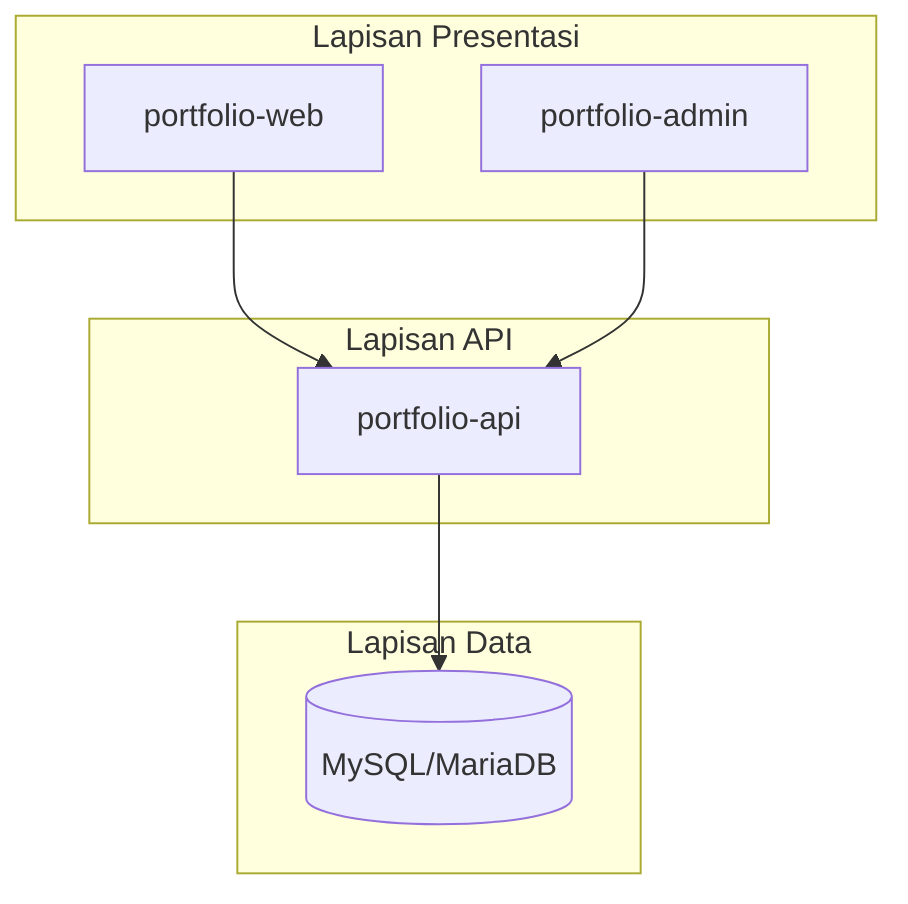

# Arsitektur Portfolio Stack

Dokumen ini memberikan **gambaran sistem** secara keseluruhan: komponen, alur akses, dan pembagian antara pengunjung (publik) dan admin. Diagram lengkap (ERD, sequence, flowchart, state, class) ada di [DIAGRAM_DAN_ERD.md](DIAGRAM_DAN_ERD.md).

---

## Daftar Isi

1. [Ringkasan](#ringkasan)
2. [Diagram Arsitektur](#diagram-arsitektur)
3. [Komponen](#komponen)
4. [Akses dan Keamanan](#akses-dan-keamanan)
5. [Referensi](#referensi)

---

## Ringkasan

| Komponen | Teknologi | Peran |
|----------|-----------|--------|
| **portfolio-api** | Lumen 10, PHP 8.1+ | REST API; autentikasi Bearer token; filter publik vs admin untuk blog-posts dan projects. |
| **portfolio-admin** | React 18, Vite | Panel admin: login, dashboard, CRUD, form relasi (nama), list relasi nama, menu sidebar berkelompok. |
| **portfolio-web** | React 18, Vite | Situs publik: home, tentang, pengalaman, pendidikan, skills, proyek, blog, sertifikasi, kontak. |
| **Database** | MySQL / MariaDB | Penyimpanan data; diakses **hanya** oleh API. |

Admin dan web sama-sama memanggil API. **Akses dibedakan** berdasarkan ada/tidaknya token:

- **Tanpa token (publik):** Hanya data yang dipublikasi untuk blog-posts dan projects; POST contact.
- **Dengan token (admin):** Akses penuh termasuk draft dan semua mutasi (POST, PUT, PATCH, DELETE).

---

## Diagram Arsitektur

### Konteks Sistem (Klien → Aplikasi → Backend)

### Lapisan (Layered View)

Diagram tambahan (sequence login/kontak/publish, flowchart alur bisnis, state draft/published, class domain): **[DIAGRAM_DAN_ERD.md](DIAGRAM_DAN_ERD.md)**.

---

## Komponen

| Komponen | Teknologi | Peran |
|----------|-----------|--------|
| **portfolio-api** | Lumen 10, PHP 8.1+ | REST API; auth token; filter publik vs admin untuk blog-posts dan projects. |
| **portfolio-admin** | React 18, Vite | Panel admin: login, current user, CRUD, form relasi (select nama), list relasi nama, menu dropdown. |
| **portfolio-web** | React 18, Vite | Situs publik: home, tentang, pengalaman, pendidikan, skills, proyek, blog, sertifikasi, kontak. |
| **Database** | MySQL / MariaDB | Penyimpanan; diakses hanya oleh API. |

---

## Akses dan Keamanan

### Tanpa token (publik)

- **GET** resource umum (users, experiences, educations, skills, projects, blog-posts, tags, certifications, dll.).
  - Untuk **blog-posts** dan **projects**: hanya item dengan `is_published = true`; akses by ID ke draft → **404**.
- **POST** `/api/contact` — form kontak pengunjung (rate limited).

### Dengan token (admin)

- Semua **mutasi** (POST, PUT, PATCH, DELETE) pada resource.
- Akses penuh ke **contact-messages** (list, show, update, delete).
- GET blog-posts dan projects dapat mengembalikan **semua** data (termasuk draft); filter `is_published` tersedia.

Perilaku rinci endpoint blog-posts dan projects: [PUBLIKASI_WEB.md](PUBLIKASI_WEB.md).

---

## Referensi

| Dokumen | Isi |
|---------|-----|
| [DIAGRAM_DAN_ERD.md](DIAGRAM_DAN_ERD.md) | ERD, diagram urutan (sequence), flowchart, state, class, arsitektur deploy. |
| [SRS-PORTFOLIO.md](SRS-PORTFOLIO.md) | Kebutuhan fungsional (FR) dan non-fungsional (NFR). |
| [PERANCANGAN_ADMIN.md](PERANCANGAN_ADMIN.md) | Fitur admin: login, current user, auto-fill user_id, form/list relasi nama, menu dropdown. |
| [PUBLIKASI_WEB.md](PUBLIKASI_WEB.md) | Tabel perilaku API (publik vs admin) untuk blog-posts dan projects. |
| [AUDIT_REPORT_ISO27001.md](AUDIT_REPORT_ISO27001.md) | Laporan audit keamanan (API & admin). |
| [../DEPLOY.md](../DEPLOY.md) | Deploy stack dengan Podman/Docker Compose. |
| [../portfolio-api/README.md](../portfolio-api/README.md) | Setup dan menjalankan API. |
| [../portfolio-admin/README.md](../portfolio-admin/README.md) | Setup admin. |
| [../portfolio-web/README.md](../portfolio-web/README.md) | Setup situs publik. |
