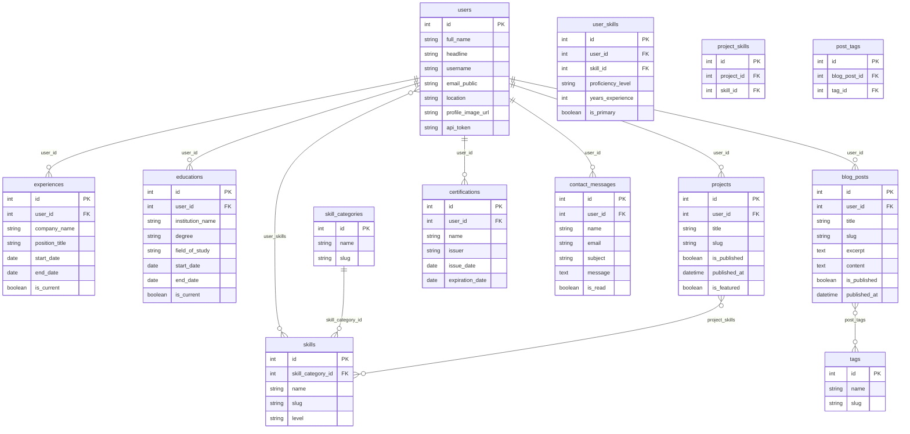

# Diagram dan ERD Proyek Portfolio

Dokumen ini memuat **diagram lengkap** untuk proyek portfolio: arsitektur sistem, Entity Relationship Diagram (ERD), diagram urutan (sequence), flowchart, diagram state, dan diagram class. Semua diagram dalam format **Mermaid** agar mudah di-render dan dirawat.

**Daftar isi**

1. [Arsitektur Sistem](#1-arsitektur-sistem)
2. [Entity Relationship Diagram (ERD)](#2-entity-relationship-diagram-erd)
3. [Diagram Urutan (Sequence)](#3-diagram-urutan-sequence)
4. [Flowchart Alur Bisnis](#4-flowchart-alur-bisnis)
5. [Diagram State](#5-diagram-state)
6. [Diagram Class (Ringkas)](#6-diagram-class-ringkas)
7. [Referensi Dokumen](#7-referensi-dokumen)

---

## 1. Arsitektur Sistem

### 1.1 Konteks Sistem (Klien – API – Database)

Siapa mengakses apa: pengunjung lewat web (GET publik), admin lewat panel dengan token.

### 1.2 Arsitektur Lapisan (Layered)

### 1.3 Deploy (Container)

Stack dijalankan dengan Podman/Docker Compose: db → api → web, admin.

Detail: [ARSITEKTUR.md](ARSITEKTUR.md), [../DEPLOY.md](../DEPLOY.md).

---

## 2. Entity Relationship Diagram (ERD)

Model data di database (MySQL/MariaDB) yang dipakai oleh portfolio-api. Tabel pivot: `user_skills`, `project_skills`, `post_tags`.

Sumber kebenaran relasi: [portfolio-api/app/Models/](../portfolio-api/app/Models/).

---

## 3. Diagram Urutan (Sequence)

### 3.1 Login Admin

### 3.2 Pengunjung Mengirim Form Kontak

### 3.3 Admin Mempublikasikan Blog Post

### 3.4 Pengunjung Melihat Daftar Blog (Publik)

Detail perilaku publik vs admin: [PUBLIKASI_WEB.md](PUBLIKASI_WEB.md), [ALUR_KONTEN_POST.md](ALUR_KONTEN_POST.md).

---

## 4. Flowchart Alur Bisnis

### 4.1 Alur Publikasi (Siapa Melihat Apa)

Request tanpa token hanya mendapat blog posts dan projects yang `is_published = true`; dengan token admin melihat semua.

### 4.2 Alur Admin: Login dan Auto-fill Konten

Setelah login, current user disimpan; saat buka form Tambah, field user_id terisi otomatis.

Detail: [PERANCANGAN_ADMIN.md](PERANCANGAN_ADMIN.md).

### 4.3 Alur Pengunjung (User Flow Situs Publik)

### 4.4 Alur Admin CRUD (Contoh: Blog Post)

---

## 5. Diagram State

### 5.1 Status Blog Post dan Project (Published / Draft)

- **Draft:** Tidak tampil di situs publik (GET tanpa token → 404 untuk by-id).
- **Published:** Tampil di daftar dan detail untuk pengunjung.

### 5.2 Status Pesan Kontak (Read / Unread)

- **Unread:** Ditandai di list (bold/background), badge notifikasi di header admin.
- **Read:** Setelah admin membuka atau klik "Mark as Read".

---

## 6. Diagram Class (Ringkas)

Ringkasan entitas domain utama dan relasi (berbasis model API/database). Untuk implementasi lengkap lihat model Eloquent di `portfolio-api/app/Models/`.

---

## 7. Referensi Dokumen

| Dokumen | Isi |
|--------|-----|
| [ARSITEKTUR.md](ARSITEKTUR.md) | Arsitektur stack, komponen, akses publik vs admin. |
| [SRS-PORTFOLIO.md](SRS-PORTFOLIO.md) | Kebutuhan fungsional (FR) dan non-fungsional (NFR). |
| [PUBLIKASI_WEB.md](PUBLIKASI_WEB.md) | Perilaku endpoint blog-posts dan projects (publik vs admin). |
| [PERANCANGAN_ADMIN.md](PERANCANGAN_ADMIN.md) | Fitur admin: login, current user, relasi form/list, menu. |
| [ALUR_KONTEN_POST.md](ALUR_KONTEN_POST.md) | Alur konten blog dari admin hingga tampil di web. |
| [../DEPLOY.md](../DEPLOY.md) | Deploy dengan Podman/Docker Compose. |
